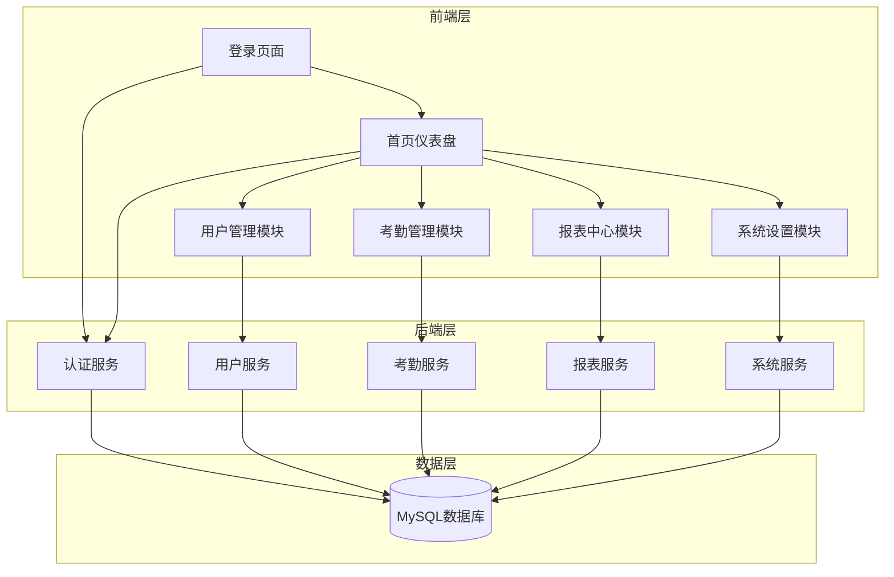

# 实名制考勤Web端管理后台系统 - 技术架构文档

## 1. 技术选型

### 1.1 前端技术栈
| 分类 | 技术 | 版本 | 说明 |
|------|------|------|------|
| 框架 | React | 18.x | 前端框架 |
| 语言 | TypeScript | 5.x | 类型安全 |
| 状态管理 | Redux Toolkit | 2.x | 全局状态管理 |
| UI组件 | Ant Design | 5.x | UI组件库 |
| 路由 | React Router | 6.x | 路由管理 |
| 图表 | ECharts | 5.x | 数据可视化 |
| 构建工具 | Vite | 6.x | 构建工具 |

### 1.2 后端技术栈
| 分类 | 技术 | 版本 | 说明 |
|------|------|------|------|
| 框架 | Node.js | 20.x | 运行时环境 |
| 框架 | Express | 4.x | Web框架 |
| 数据库 | MySQL | 8.x | 关系型数据库 |
| ORM | Sequelize | 6.x | ORM框架 |
| 认证 | JWT | - | 身份认证 |
| 密码加密 | bcrypt | 5.x | 密码哈希 |

### 1.3 开发工具
| 工具 | 说明 |
|------|------|
| Git | 版本控制 |
| ESLint | 代码检查 |
| Prettier | 代码格式化 |

---

## 2. 系统架构

### 2.1 架构图



### 2.2 模块划分

| 模块 | 功能说明 | 对应文件 |
|------|----------|----------|
| auth | 用户认证、登录/登出 | src/api/auth.ts |
| user | 用户管理、角色管理 | src/api/user.ts |
| attendance | 考勤打卡、记录管理 | src/api/attendance.ts |
| report | 报表统计、数据分析 | src/api/report.ts |
| setting | 系统设置、规则配置 | src/api/setting.ts |

---

## 3. 目录结构

```
├── src/
│   ├── components/          # 公共组件
│   │   ├── Layout/          # 布局组件
│   │   ├── Table/           # 表格组件
│   │   ├── Form/            # 表单组件
│   │   └── Chart/           # 图表组件
│   ├── pages/               # 页面组件
│   │   ├── Login/           # 登录页面
│   │   ├── Dashboard/       # 首页仪表盘
│   │   ├── UserManagement/  # 用户管理
│   │   ├── Attendance/      # 考勤管理
│   │   ├── Reports/         # 报表中心
│   │   └── Settings/        # 系统设置
│   ├── api/                 # API接口
│   │   ├── auth.ts          # 认证接口
│   │   ├── user.ts          # 用户接口
│   │   ├── attendance.ts    # 考勤接口
│   │   ├── report.ts        # 报表接口
│   │   └── setting.ts       # 设置接口
│   ├── store/               # Redux状态管理
│   │   ├── authSlice.ts     # 认证状态
│   │   ├── userSlice.ts     # 用户状态
│   │   └── index.ts         # Store配置
│   ├── types/               # TypeScript类型定义
│   ├── utils/               # 工具函数
│   ├── App.tsx              # 应用入口
│   └── main.tsx             # React入口
├── public/                  # 静态资源
├── .env                     # 环境变量
├── package.json             # 依赖配置
├── vite.config.ts           # Vite配置
├── tsconfig.json            # TypeScript配置
└── index.html               # HTML模板
```

---

## 4. 关键类与方法设计

### 4.1 前端接口设计

#### 4.1.1 认证接口 (auth.ts)
| 方法名 | 功能说明 | 参数 | 返回值 |
|--------|----------|------|--------|
| login | 用户登录 | { username: string, password: string } | { token: string, user: User } |
| logout | 用户登出 | 无 | void |
| getCurrentUser | 获取当前用户 | 无 | User |

#### 4.1.2 用户接口 (user.ts)
| 方法名 | 功能说明 | 参数 | 返回值 |
|--------|----------|------|--------|
| getUsers | 获取用户列表 | { page: number, size: number, keyword?: string } | { list: User[], total: number } |
| getUser | 获取单个用户 | id: number | User |
| createUser | 创建用户 | user: CreateUserDto | User |
| updateUser | 更新用户 | id: number, user: UpdateUserDto | User |
| deleteUser | 删除用户 | id: number | void |

#### 4.1.3 考勤接口 (attendance.ts)
| 方法名 | 功能说明 | 参数 | 返回值 |
|--------|----------|------|--------|
| getAttendanceList | 获取考勤列表 | { userId?: number, date?: string, page: number, size: number } | { list: Attendance[], total: number } |
| checkIn | 上班打卡 | 无 | Attendance |
| checkOut | 下班打卡 | 无 | Attendance |
| getLeaveApplications | 获取请假列表 | { userId?: number, status?: string } | LeaveApplication[] |
| applyLeave | 提交请假申请 | application: LeaveApplicationDto | LeaveApplication |
| approveLeave | 审批请假 | id: number, status: string | LeaveApplication |

#### 4.1.4 报表接口 (report.ts)
| 方法名 | 功能说明 | 参数 | 返回值 |
|--------|----------|------|--------|
| getPersonalReport | 个人考勤统计 | userId: number, month: string | PersonalReport |
| getDepartmentReport | 部门考勤汇总 | departmentId: number, month: string | DepartmentReport |
| getMonthlyReport | 月度考勤报告 | month: string | MonthlyReport |

### 4.2 类型定义

#### 4.2.1 用户类型 (User)
```typescript
interface User {
  id: number;
  username: string;
  name: string;
  email: string;
  phone: string;
  idCard: string;
  photo: string;
  role: 'admin' | 'manager' | 'employee';
  departmentId: number;
  departmentName: string;
  status: 'active' | 'inactive';
  createdAt: string;
  updatedAt: string;
}
```

#### 4.2.2 考勤记录类型 (Attendance)
```typescript
interface Attendance {
  id: number;
  userId: number;
  userName: string;
  date: string;
  checkInTime: string;
  checkOutTime: string;
  status: 'normal' | 'late' | 'early' | 'absent';
  createdAt: string;
}
```

#### 4.2.3 请假申请类型 (LeaveApplication)
```typescript
interface LeaveApplication {
  id: number;
  userId: number;
  userName: string;
  type: 'annual' | 'sick' | 'personal' | 'maternity';
  startDate: string;
  endDate: string;
  reason: string;
  status: 'pending' | 'approved' | 'rejected';
  approvedBy: number;
  createdAt: string;
  updatedAt: string;
}
```

---

## 5. 数据库设计

### 5.1 用户表 (users)

| 字段名 | 类型 | 约束 | 说明 |
|--------|------|------|------|
| id | INT | PRIMARY KEY, AUTO_INCREMENT | 用户ID |
| username | VARCHAR(50) | NOT NULL, UNIQUE | 用户名 |
| password | VARCHAR(255) | NOT NULL | 密码（bcrypt加密） |
| name | VARCHAR(50) | NOT NULL | 真实姓名 |
| email | VARCHAR(100) | UNIQUE | 邮箱 |
| phone | VARCHAR(20) | UNIQUE | 手机号 |
| id_card | VARCHAR(18) | UNIQUE | 身份证号 |
| photo | VARCHAR(255) | | 照片路径 |
| role | ENUM | NOT NULL, DEFAULT 'employee' | 角色 |
| department_id | INT | FOREIGN KEY | 部门ID |
| status | ENUM | NOT NULL, DEFAULT 'active' | 状态 |
| created_at | DATETIME | NOT NULL, DEFAULT CURRENT_TIMESTAMP | 创建时间 |
| updated_at | DATETIME | NOT NULL, DEFAULT CURRENT_TIMESTAMP ON UPDATE CURRENT_TIMESTAMP | 更新时间 |

### 5.2 部门表 (departments)

| 字段名 | 类型 | 约束 | 说明 |
|--------|------|------|------|
| id | INT | PRIMARY KEY, AUTO_INCREMENT | 部门ID |
| name | VARCHAR(50) | NOT NULL, UNIQUE | 部门名称 |
| parent_id | INT | FOREIGN KEY | 上级部门ID |
| created_at | DATETIME | NOT NULL, DEFAULT CURRENT_TIMESTAMP | 创建时间 |
| updated_at | DATETIME | NOT NULL, DEFAULT CURRENT_TIMESTAMP ON UPDATE CURRENT_TIMESTAMP | 更新时间 |

### 5.3 考勤记录表 (attendance)

| 字段名 | 类型 | 约束 | 说明 |
|--------|------|------|------|
| id | INT | PRIMARY KEY, AUTO_INCREMENT | 记录ID |
| user_id | INT | FOREIGN KEY, NOT NULL | 用户ID |
| date | DATE | NOT NULL | 考勤日期 |
| check_in_time | DATETIME | | 上班打卡时间 |
| check_out_time | DATETIME | | 下班打卡时间 |
| status | ENUM | NOT NULL | 状态 |
| created_at | DATETIME | NOT NULL, DEFAULT CURRENT_TIMESTAMP | 创建时间 |

### 5.4 请假申请表 (leave_applications)

| 字段名 | 类型 | 约束 | 说明 |
|--------|------|------|------|
| id | INT | PRIMARY KEY, AUTO_INCREMENT | 申请ID |
| user_id | INT | FOREIGN KEY, NOT NULL | 用户ID |
| type | ENUM | NOT NULL | 请假类型 |
| start_date | DATE | NOT NULL | 开始日期 |
| end_date | DATE | NOT NULL | 结束日期 |
| reason | TEXT | | 请假原因 |
| status | ENUM | NOT NULL, DEFAULT 'pending' | 状态 |
| approved_by | INT | FOREIGN KEY | 审批人ID |
| created_at | DATETIME | NOT NULL, DEFAULT CURRENT_TIMESTAMP | 创建时间 |
| updated_at | DATETIME | NOT NULL, DEFAULT CURRENT_TIMESTAMP ON UPDATE CURRENT_TIMESTAMP | 更新时间 |

### 5.5 考勤规则表 (attendance_rules)

| 字段名 | 类型 | 约束 | 说明 |
|--------|------|------|------|
| id | INT | PRIMARY KEY, AUTO_INCREMENT | 规则ID |
| work_start_time | TIME | NOT NULL | 上班时间 |
| work_end_time | TIME | NOT NULL | 下班时间 |
| late_threshold | INT | DEFAULT 15 | 迟到阈值（分钟） |
| early_threshold | INT | DEFAULT 15 | 早退阈值（分钟） |
| check_in_range_start | TIME | | 上班打卡开始时间 |
| check_in_range_end | TIME | | 上班打卡结束时间 |
| check_out_range_start | TIME | | 下班打卡开始时间 |
| check_out_range_end | TIME | | 下班打卡结束时间 |
| created_at | DATETIME | NOT NULL, DEFAULT CURRENT_TIMESTAMP | 创建时间 |
| updated_at | DATETIME | NOT NULL, DEFAULT CURRENT_TIMESTAMP ON UPDATE CURRENT_TIMESTAMP | 更新时间 |

---

## 6. API接口设计

### 6.1 认证接口

| API路径 | HTTP方法 | 功能描述 |
|---------|----------|----------|
| /api/auth/login | POST | 用户登录 |
| /api/auth/logout | POST | 用户登出 |
| /api/auth/me | GET | 获取当前用户信息 |

#### 6.1.1 POST /api/auth/login
请求体：
```json
{
  "username": "string",
  "password": "string"
}
```

响应体：
```json
{
  "success": true,
  "data": {
    "token": "string",
    "user": {
      "id": 1,
      "username": "admin",
      "name": "管理员",
      "role": "admin",
      "departmentId": 1,
      "departmentName": "技术部"
    }
  }
}
```

### 6.2 用户管理接口

| API路径 | HTTP方法 | 功能描述 |
|---------|----------|----------|
| /api/users | GET | 获取用户列表 |
| /api/users/:id | GET | 获取单个用户 |
| /api/users | POST | 创建用户 |
| /api/users/:id | PUT | 更新用户 |
| /api/users/:id | DELETE | 删除用户 |

#### 6.2.1 GET /api/users
请求参数：
- page: 页码（默认1）
- size: 每页数量（默认10）
- keyword: 搜索关键词

响应体：
```json
{
  "success": true,
  "data": {
    "list": [...],
    "total": 100
  }
}
```

#### 6.2.2 POST /api/users
请求体：
```json
{
  "username": "string",
  "password": "string",
  "name": "string",
  "email": "string",
  "phone": "string",
  "idCard": "string",
  "role": "admin | manager | employee",
  "departmentId": 1
}
```

### 6.3 考勤管理接口

| API路径 | HTTP方法 | 功能描述 |
|---------|----------|----------|
| /api/attendance | GET | 获取考勤列表 |
| /api/attendance/check-in | POST | 上班打卡 |
| /api/attendance/check-out | POST | 下班打卡 |
| /api/leave | GET | 获取请假列表 |
| /api/leave | POST | 提交请假申请 |
| /api/leave/:id/approve | PUT | 审批请假 |

### 6.4 报表接口

| API路径 | HTTP方法 | 功能描述 |
|---------|----------|----------|
| /api/reports/personal | GET | 个人考勤统计 |
| /api/reports/department | GET | 部门考勤汇总 |
| /api/reports/monthly | GET | 月度考勤报告 |

### 6.5 系统设置接口

| API路径 | HTTP方法 | 功能描述 |
|---------|----------|----------|
| /api/settings/attendance-rule | GET | 获取考勤规则 |
| /api/settings/attendance-rule | PUT | 更新考勤规则 |
| /api/settings/departments | GET | 获取部门列表 |
| /api/settings/departments | POST | 创建部门 |
| /api/settings/departments/:id | PUT | 更新部门 |
| /api/settings/departments/:id | DELETE | 删除部门 |

---

## 7. 安全设计

### 7.1 认证机制
- 使用JWT Token进行身份认证
- Token有效期设置为2小时
- 支持Token刷新机制

### 7.2 权限控制
- 基于角色的访问控制（RBAC）
- 前端路由守卫
- 后端接口权限校验

### 7.3 数据安全
- 密码使用bcrypt加密存储
- 敏感信息传输使用HTTPS
- 输入数据进行严格验证

---

## 8. 部署与集成

### 8.1 前端部署
- 使用Vite构建生产版本
- 部署到Nginx或静态文件服务器

### 8.2 后端部署
- 使用PM2进行进程管理
- 配置环境变量
- 配置Nginx反向代理

### 8.3 数据库配置
- 创建MySQL数据库
- 配置数据库连接信息
- 执行数据库迁移脚本